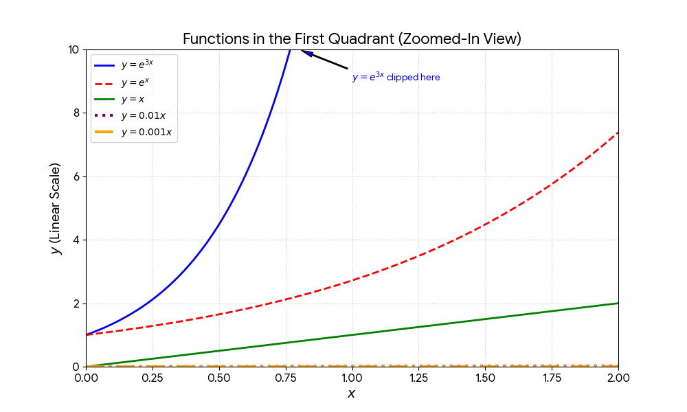

# Improve Metrics on No. of Iterations 
### Iteration 1:
- Goal is to improve visibility
- Finish testing on Llama-3.1
- Main improvement over Oct: Resolved issues that interrupted processes and caused continuous downtime, Better supported to face such issues at scale in the future.

### Iteration 1 Results:
- Identified strong on ML, coding
- Significantly weak at networking
- Got to the root causes, restructured it
- Expanded the team, got guidance of an extremely talented professional who's great at networking.
- I was able to reuse the templates, and many methods, rather than developing from scratch, enabled me to get faster improvement, so I could ensure visiblity for research without compromising on time trade off.
- For iter 2, I'd advice: Execution eats Strategy for breakfast, so much more focus on execution over strategy.

### Iteration 2:
- Improve visibility
 
### Iteration 2 Results:
- Improved visibility exponentially
- Validated the quality of work by senior engineers from Big Tech
- Excellent presentation and Networking Skills
  

# Aiming for $$e^{3x}$$ growth, cuz Win Big
### If you fail, still you would've gone further than you would've with incremental growth
### If you win, you can accelerate further and maximize returns and it ensures you're not blinded by local maxima

### Iteration $$e^{3x}$$: 
- Get an interview process started in at least 3 companies
- DM or Email at least 20 people
- Progress on research
- Progress on coding 

