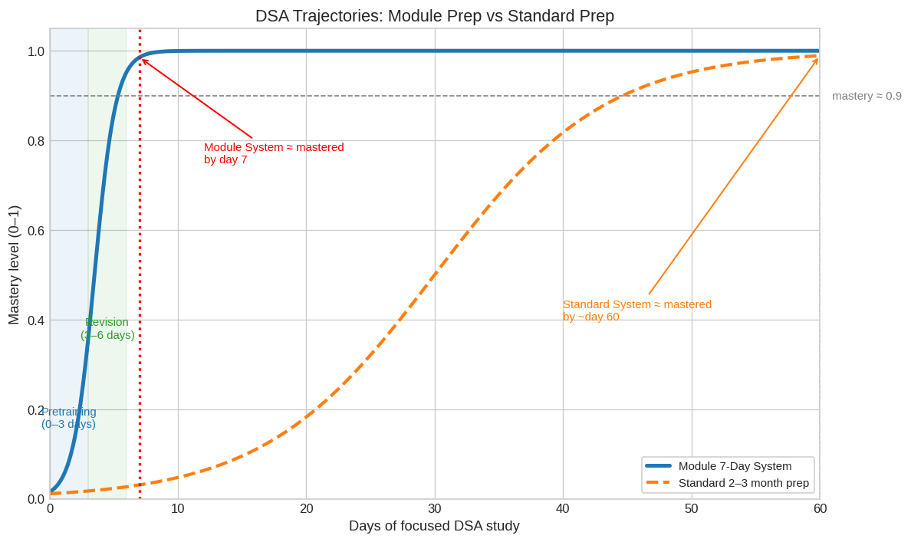

# A Week to Achieve Insane Goals

This is a fun crazy launch because I want some exponential growth in tasks and I don't have the patience to wait for several weeks. I want everything done superfast. So, I'm gonna make it happen.

- Master all DSA patterns - basic coding should be fun, and I don't think one should allocate more time for it. Why do it in 10 weeks when you can do it in 10 days? Doesn't make sense.
- Finish off sparse attention - just final lap left. closing it will help me gain momentum with visibility. It builds confidence to email some pretty good engineers.
- Zero in on some 3 teams at least or 30 whatever seems ideal in the process. We need some revenue coming in.

# Updates 
### Goal 1. Completed Master all DSA patterns!!!
- Came up with a new way of learning.
- Designed learning in 3 stages:
  
## 1. Pretraining: 
## Trick: Build a revision module for all DSA topics.
- 66.5 hrs over Fri, Sat, Sun and Monday Morning 
- Outcome: I'm comfortable with all DSA topics.
- Huge Degree improvement from Friday, when I started **10% -> 60%**
- Time: 3 days
## 2. Revising
- With revision module, I can cover one round of revision in a day across all topics.
- That should make me confident in over 150 problems. **Confidence score: 90%**
- Time: 3 days (3 rounds of revision)
## 3. Generalizing
  - Train on my own. This would be easy since all I have to do is match the patterns that I already have terrific experience in 5 problems on average per topic, revised 3-4 times = 20 times, I might've gone through the pattern before the entirely new set.
  - Time: From Day 7
## Mathematically Possible, Why not make it happen? 
 
- I learnt if the design is faulty, then the time invested doesn't really do much. It's better to understand core of how to tackle the work and design an approach first rather than just going ahead and brute force executing.
- Learning Trees, makes you smarter with Graphs, and learning heaps, stacks, and queues, really prepares you for Dynamic Programming.
- Transfer learning basically does the magic. When you input extensive data intially, it helps the brain to capture patterns, making learning faster as you progress through stages.

# Next on List: Sparse attention!

